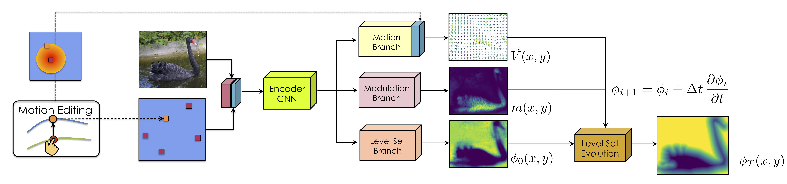

# Deep Extreme Level Set Evolution (DELSE)

This is the PyTorch implementation of DELSE model for object instance segmentation. This repository provides code to train and evaluate with DELSE. For details, please refer to:  

**Object Instance Annotation with Deep Extreme Level Set Evolution**  
[Zian Wang](http://www.cs.toronto.edu/~zianwang/), [David Acuna](http://www.cs.toronto.edu/~davidj/)\*, [Huan Ling](http://www.cs.toronto.edu/~linghuan/)\*, [Amlan Kar](http://www.cs.toronto.edu/~amlan/), [Sanja Fidler](https://www.cs.utoronto.ca/~fidler/)

**[[Project Page](http://www.cs.toronto.edu/~zianwang/DELSE/delse.html)][[Paper](http://www.cs.toronto.edu/~zianwang/DELSE/zian19delse.pdf)] [[Poster](http://www.cs.toronto.edu/~zianwang/DELSE/poster.pdf)][[bibtex](http://www.cs.toronto.edu/~zianwang/DELSE/bibtex.txt)]**  

**CVPR 2019**



<!--
*We revive the old ideas on level set segmentation which framed object annotation as curve evolution. The Level Set Method can handle objects with complex shapes and topological changes such as merging and splitting, thus able to deal with occluded objects and objects with holes. We propose Deep Extreme Level Set Evolution (DELSE) that combines powerful CNN models with level set optimization in an end-to-end fashion. Our method learns to predict evolution parameters conditioned on the image and evolves the predicted initial contour to produce the final result. Carefully designed energy functions ensured that the curve was well aligned with image boundaries, and generally "well behaved". Our model is interactive by incorporating user clicks on the extreme boundary points and allows further correction on erroneous boundary.*   
(\* denotes equal contribution)    
----------------------- ------------------------------------
-->

## Where is the code?
~~To get the code, please sign up [here](http://www.cs.toronto.edu/delse/code_signup/). We will be using GitHub to keep track of issues with the code and to update on availability of newer versions (also available on website and through e-mail to signed up users).~~

The code sign-up server was down. Please contact zianwang@cs.toronto.edu for access. 

If you find this code helpful, please consider citing 

	@inproceedings{DELSE2019,
	title={Object Instance Annotation with Deep Extreme Level Set Evolution},
	author={Zian Wang and David Acuna and Huan Ling and Amlan Kar and Sanja Fidler},
	booktitle={CVPR},
	year={2019}
	}


## Installation
The code was tested with Anaconda (Python 3.6) and PyTorch 0.4.1. 

1. Install dependencies:

    ```
    conda install pytorch torchvision -c pytorch
    conda install matplotlib opencv pillow scikit-image
    pip install tensorboard tensorboardx
    ```
  
2. Download the pre-trained PSPNet model. 

    ```Shell
    cd models/
    chmod +x download_pretrained_psp_model.sh
    ./download_pretrained_psp_model.sh
    ```

3. Set the paths in ```mypath.py```, so that they point to the appropriate locations of PASCAL/SBD/DAVIS/CityScapes dataset.


## Data 

### Cityscapes
- Download the Cityscapes dataset (leftImg8bit\_trainvaltest.zip) from the official [website](https://www.cityscapes-dataset.com/downloads/) [11 GB]
- Download our processed annotation files from [here](http://www.cs.toronto.edu/~amlan/data/polygon/cityscapes.tar.gz) [68 MB]
- From the root directory, run the following command with appropriate paths to get the annotation files ready for your machine
```
python dataloaders/change_paths.py --city_dir <path_to_downloaded_leftImg8bit_folder> --json_dir <path_to_downloaded_annotation_file> --output_dir <output_dir>
```
- Set the path in mypath.py to the location of CityScapes dataset.


## Scripts


### Project Structure

```
.
├── networks        				# backend CNN modules
|   └── ...       		
├── layers           			# loss and level set evolution mechanism
|   └── ...
├── dataloaders           			# thank DEXTR and PolyRNN for loaders
|   ├── cityscapes.py       		
|   ├── davis.py        			
|   ├── pascal.py    				
|   ├── sbd.py    					
|   ├── custom_transforms.py    	# transforms for data
|   ├── helpers.py    			# helper functions used in data processing
|   └── ...
├── models				# deeplab pretrained model
|   └── ...
├── evaluation						
|   └── eval.py				# function for eval
|
├── DELSE.py       			# model
├── mypath.py     			# path for datasets
├── eval_multi.py     			# run multi evaluation 
└── main.py        			# training and testing

```


### Training

Run ```python main.py``` for training. The default argparse parameters is for Cityscapes. 
The parameters of settings are in main.py. 

### Evaluation
Set the index of experiments and evaluation settings in eval\_multi.py (Line 14-18 in function param\_generateor). 
Run ```python eval_multi.py``` for evaluation on your predicted results. 

The model ckeckpoint on Cityscapes dataset can be found [here](http://www.cs.toronto.edu/~zianwang/share/delse/cityscapes_ckpt.pth). If the intermediate outputs are not saved, please get the inference outputs first with the test function in DELSE.py. 


-----------------------------------------------------------


If you have questions with this code, please contact zianwang@cs.toronto.edu.
We would like to thank [DEXTR](https://github.com/scaelles/DEXTR-PyTorch) for releasing their code. 
